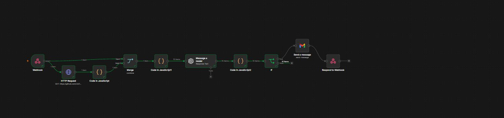

# 🚀 Assistente de Investimentos Automático (RPA + N8N + IA)

Este projeto consiste em um fluxo automatizado de comunicação personalizada para clientes de investimentos, combinando **RPA**, **Workflows N8N** e **Inteligência Artificial Generativa (LLM/GPT-4o)** para análise de perfil e envio de e-mails customizados.

---

## 📸 Fluxo de Trabalho (N8N Pipeline)

Abaixo está a representação visual do fluxo de trabalho construído no N8N:



---

## 🛠️ Requisitos e Desafios Atendidos

### 1. MVP (Mínimo Viável)
- [x] **Repositório Forkado e Implantado**: Projeto estruturado para rodar no N8N.
- [x] **Workflow Exportado**: Disponível em `n8n/workflow.json` (inclui tratamento de dados e fallback estático).
- [x] **Integração via Webhook**: O nó inicial recebe requisições `POST` de automações externas/RPA contendo a lista de clientes.
- [x] **Demonstração Ponta a Ponta**: Envio validado diretamente via nó de e-mail (Gmail) com resposta de sucesso HTTP 200 via `Respond to Webhook`.

### 2. Desafio Completo
- [x] **Integração com Agente de IA**: Nó `Message a model` configurado com **OpenAI GPT-4o**.
- [x] **Mensagens Geradas Dinamicamente**: Prompt customizado instruindo a LLM a retornar JSON estruturado com corpo em texto plano e HTML, respeitando o tom adequado ao perfil financeiro sem promessas irrealistas.
- [x] **Documentação Técnica Completa**: Explicação do fluxo de dados e das escolhas de arquitetura.

---

## ⚙️ Arquitetura do Fluxo de Dados

```
[Webhook (POST)] ---> [HTTP Request (CSV)] ---> [Code (Parse CSV)] 
          |                                            |
          +-----------------> [Merge] <----------------+
                                 |
                       [Code: Format Client Data]
                                 |
                   [LLM: OpenAI GPT-4o Agent]
                                 |
                     [Code: Parse & Map Emails]
                                 |
                       [IF: Valid Target?]
                                 |
                    [Gmail: Send Message]
                                 |
                      [Respond to Webhook]
```

### Detalhamento dos Nós:
1. **Webhook (`/Clientes`)**: Ponto de entrada HTTP que recebe a carga útil contendo a lista de clientes.
2. **HTTP Request & Code (`Parse CSV`)**: Busca dados complementares de investimentos via requisição externa em CSV e faz o parse estruturado em JavaScript.
3. **Merge**: Combina os dados brutos recebidos pelo webhook com a tabela de produtos/investimentos.
4. **Code in JavaScript1**: Formata os saldos dos clientes em moeda local (BRL) e define fallback estático baseado em `perfil` (Conservador, Moderado, Arrojado).
5. **Message a model (OpenAI GPT-4o)**: Envia as informações formatadas do cliente com o prompt:
   > *"Escrever um e-mail curto em PT-BR para o cliente... sem prometer ganhos e sem garantia. Retorne Apenas JSON com `subject`, `text_body` e `html_body`."*
6. **Code in JavaScript2**: Faz o parse do JSON retornado pela IA, trata eventuais formatações Markdown e associa o e-mail de destino correto a cada cliente.
7. **If**: Valida a presença e o formato básico de um e-mail válido antes de disparar a mensagem.
8. **Send a Message (Gmail)**: Realiza o envio dinâmico do e-mail.
9. **Respond to Webhook**: Retorna status `200 OK` para o client/RPA requisitante após a conclusão do ciclo.

---

## 🧠 Decisões Técnicas

1. **Garantia de Payload Estruturado (JSON Output na LLM)**:
   - Para evitar inconsistências no formato de texto livre gerado por IA, foi exigida a resposta estritamente em formato JSON contendo `subject`, `text_body` e `html_body`.
2. **Tratamento de Exceções & Sanitização**:
   - No nó `Code in JavaScript2`, aplicou-se uma rotina de `try-catch` e remoção de trechos markdown (` ```json `), garantindo que falhas de parse da IA não interrompam o pipeline.
3. **Validação de E-mail via Regex**:
   - Adicionou-se uma etapa condicional (`If`) com verificação Regex de e-mail para impedir requisições inválidas no nó do Gmail, economizando quota de API e prevenindo erros.
4. **Resiliência e Fallback**:
   - No nó `Code in JavaScript1`, mensagens estáticas padrão foram pré-geradas para cada perfil de investidor. Isso possibilita fácil alteração caso a aplicação precise rodar offline ou sem a camada de LLM.
5. **Observação da imagem**:
   - Desativei o fluxo no final do e-mail, para retirar minhas credenciais para baixar o arquivo n8n em json.

---


## 💻 Como Importar e Executar

1. Importe o arquivo `n8n/workflow.json` no seu ambiente N8N.
2. Certifique-se de configurar as credenciais:
   - **OpenAI API Key** (para o nó `Message a model`).
   - **Gmail OAuth2** (para o nó `Send a message`).
3. Ative o workflow.
4. Envie uma requisição `POST` com a lista de clientes para a URL do Webhook do N8N.
